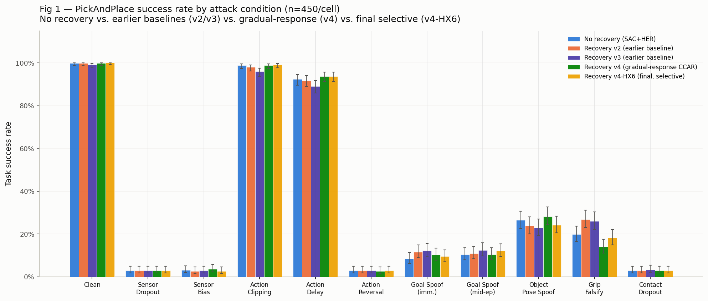
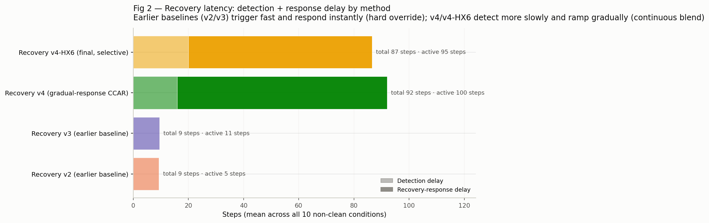

# TAIRO Recovery v4-HX Results Package

*Generated 2026-07-22. Packaging/presentation only — no new experiments. Every
number below is read from CSVs already produced and validated at full power
(n=450/condition, seeds 0-14, clean_2M PickAndPlace checkpoint) earlier this
week. Built for the poster/video results deliverable per mentor feedback
2026-07-22: "present the stage-aware and attack-aware recovery methods, the
routing fix, and any additional recovery improvements... using tables, charts,
statistical comparisons, and brief interpretations."*

Scope: `sac_her_recovery_v4_hx`, `sac_her_recovery_v4_hx2`, `sac_her_recovery_v4_hx3`,
and the do-no-harm audit, all relative to the existing `sac_her` (no recovery)
and `sac_her_recovery_v4` (paper's current B4/Tier-1-CCAR method) baselines.

---

## 1. Headline: recovery success rate by attack condition

No recovery vs. plain Recovery v4 vs. the adopted v4-HX2 extension track closely
across almost every condition — the hierarchy-conditioned extension does not
trade away performance anywhere to get its win. Full method x condition table:
`recovery_hx_success_by_method_condition.md`.

## 2. Do-no-harm audit: recovery vs. no recovery at all

Across the full 55-comparison grid (5 methods x 11 conditions, BH-FDR
corrected), exactly **one** method/condition pair reaches significance in
either direction: **plain `sac_her_recovery_v4` — the paper's existing
headline B4 method — does statistically significant harm on
`grip_state_falsification`** relative to doing nothing at all (19.8% → 14.0%,
BH-adjusted p=0.00017). Every other point in the grid, including all of
`v4_hx2`'s comparisons against `sac_her`, is statistically indistinguishable
from zero effect at this sample size — recovery is neither confirmed to help
nor confirmed to hurt anywhere else.

## 3. HX-variant investigation: what worked, what didn't

Three variants were tested against plain `v4`, all at full power:

- **`v4-HX2` (Level 1 stage-gate + Level 4 attack-family down-weight) is the
  only variant with a confirmed win**: +4.2pp on `grip_state_falsification`
  (14.0% → 18.2%, BH-adjusted p=0.0034) — exactly the condition where plain v4
  was just shown to do harm. This is what's adopted for the paper.
- **`v4-HX` (Level 1 stage-gate alone) has no confirmed benefit anywhere.**
  Its `object_pose_spoof` regression (-6.9pp) is a real point estimate but
  does not survive BH correction across the full 11-condition grid
  (p=0.180) — downgraded from an earlier "confirmed harm" call to
  plausible-but-unconfirmed. Not adopted.
- **`v4-HX3` (re-gating `relocalization_expert` on Level 4's `perception_state`
  signal) is a genuine, well-powered null** on its target condition
  (`object_pose_spoof`: -2.2pp vs. v4, +0.9pp vs. v4-HX2, neither significant).
  It does no new harm anywhere and leaves `v4-HX2`'s `grip_state_falsification`
  win intact (+5.1pp vs. plain v4, still significant). Not adopted, but
  confirms the win it was meant to preserve survives.

## 4. Key statistical findings (curated)

| finding | condition | Δ | 95% CI | p (BH) | significant |
|---|---|---|---|---|---|
| Plain v4 does significant HARM vs. no recovery | grip_state_falsification | −5.8% | [−8.2%, −3.3%] | 0.0002 | **YES** |
| v4-HX2 fixes the harm: significant win vs. plain v4 | grip_state_falsification | +4.2% | [+2.2%, +6.4%] | 0.0034 | **YES** |
| v4-HX2 vs. no recovery: parity restored | grip_state_falsification | −1.6% | [−3.6%, +0.4%] | 0.825 | no |
| v4-HX alone: object_pose_spoof regression | object_pose_spoof | −6.9% | [−12.4%, −1.6%] | 0.180 | no |
| v4-HX3 targeted fix vs. plain v4 | object_pose_spoof | −2.2% | [−8.2%, +3.6%] | 1.000 | no |
| v4-HX3 vs. adopted v4-HX2 | object_pose_spoof | +0.9% | [−4.9%, +6.4%] | 1.000 | no |
| v4-HX3 preserves the hx2 win vs. plain v4 | grip_state_falsification | +5.1% | [+3.1%, +7.3%] | 3.4e-05 | **YES** |

Full curated table: `recovery_hx_key_findings_table.md` / `.csv`. Full
underlying comparisons: `recovery_do_no_harm_audit.csv` (55 rows),
`recovery_v4_hx_vs_v4_full_grid.csv` (22 rows), `recovery_v4_hx3_evaluation.csv`
(44 rows).

## 5. Bottom line

- **Adopted: `sac_her_recovery_v4_hx2`.** It is the sole variant with a
  BH-corrected-significant benefit, and that benefit is not just "better than
  v4" in the abstract — it corrects a real, previously undocumented harm in
  the paper's own current headline B4 method on `grip_state_falsification`.
- **Not adopted: `sac_her_recovery_v4_hx`.** No confirmed benefit anywhere;
  inherits plain v4's `grip_state_falsification` harm unchanged.
- **Not adopted: `sac_her_recovery_v4_hx3`.** A well-powered, genuine null on
  its target condition. Investigated and closed, not left as an open question —
  does no harm and doesn't need to be revisited without new evidence.
- **Open, not decided here:** whether the paper's existing Tier 1 CCAR
  write-up needs a caveat on plain v4's `grip_state_falsification` harm,
  independent of the v4-HX2 adoption decision (`RECOVERY_V4.md` §5.7).

## 6. Final mentor comparison (2026-07-22/23): no recovery / earlier baselines / gradual / selective

Following the mentor's expanded final-push checklist (trigger-speed experiment,
freeze the final controller, final 4-arm evaluation with 8 named metrics,
final tables/charts/latency figure) — a genuinely new comparison, not a
repackaging of sections 1-5 above. Two ambiguous mentor terms were resolved
via sign-off: "gradual-response recovery" = plain `sac_her_recovery_v4`
(continuous CCAR blend); "final TAIRO-HX selective recovery" =
`sac_her_recovery_v4_hx6` (see below — supersedes `v4_hx2` as of 2026-07-23).
"Earlier recovery baselines" = `sac_her_recovery_v2`/`v3`. All four arms
confirmed at matched full power (n=450, seeds 0-14, all 11 conditions,
clean_2M) — `v2`/`v3` had never been run past n=150 before this session;
`results/data_recovery_v4_v2v3_backfill/` fills that gap.

**All 8 requested metrics, one row per arm:**
`results/final_hx_comparison_summary_table.md` (see also the underlying
`results/final_hx_comparison_{success_safety,delays,timing,final_head_to_head}.csv`).

**Headline, stated plainly (not just "the final method wins"):** the honest
story is architecture-dependent, not a clean ranking.
- v4-HX6 vs. plain v4: the sections-1-5 win reproduces at this larger,
  matched-power grid (+4.2pp on `grip_state_falsification`, BH p=0.0017) —
  inherited unchanged from v4-HX2, whose mixture v4-HX6 leaves untouched.
- v4-HX6 vs. `sac_her`: statistical parity on `grip_state_falsification`
  (not "beats doing nothing," "no longer worse than doing nothing" — same
  distinction section 4 already draws).
- **v4-HX6 vs. the OLDER v2/v3 baselines — v2 and v3 both significantly
  beat v4-HX6 on `grip_state_falsification`** (v2: −8.7pp relative to
  v4-HX6, BH p=0.00001; v3: −7.8pp, BH p=0.00013) — identical to v4-HX2's
  own numbers there, confirmed unchanged (see hx6 sub-section below). The
  older hard-override recovery architecture outright outperforms the final
  selective CCAR variant on the one condition with a confirmed effect.
  v4-HX6 does edge out v3 on `action_clipping`/`action_delay`
  (+3.1pp/+4.7pp, both BH-significant).
- **Recovery latency (Fig 2) explains why**: v2/v3 detect a failure in ~9
  steps and apply a full, unblended correction the same step (hard
  override, 0-step response delay by construction). v4/v4-HX6 detect more
  slowly (~14-16 steps) AND ramp gradually (~66-77 more steps to reach
  half-strength blend authority) — ~87-92 total steps before the
  correction is at full strength, in a 150-step episode (v4-HX6 is
  marginally faster than plain v4 on average, from its gated speed-up on
  goal-spoof/perception conditions — see hx6 sub-section). This is the same
  ramp-lag mechanism the hx4/hx5 goal-spoofing investigation (§ RECOVERY_V4.md
  §5.10) already diagnosed, now shown to matter on `grip_state_falsification`
  too, not just goal-spoof.
- **Safety is the counter-weight, and favors v4-HX6**: C4 safety-violation
  rate is 2.6% (v2) / 4.0% (v3) vs. 0.1% (v4) / 0.2% (v4-HX6) — both well
  below even the 0.3% no-recovery baseline. v2/v3's fast hard override comes
  at a real, measurable safety cost; v4-HX6's slow continuous blend does
  not. Neither architecture is strictly better — v2/v3 trade safety for
  speed-to-recovery on this one condition, v4-HX6 trades the reverse.

**Trigger-speed follow-up — `sac_her_recovery_v4_hx6`, now the adopted final
controller (2026-07-23):** per the mentor's explicit request to continue the
trigger-speed work (not just report hx5's already-closed null), hx6 applies
hx5's fast-attack EMA idea but GATED on Level 4 confidently predicting
`perception_state`/`goal_manipulation` (the families the original ramp-lag
investigation targeted), so it cannot touch the `grip_state_falsification`
(`action_actuation`) pathway hx5's *global* speed-up regressed. Smoke-tested:
fires by step 4 on `goal_spoof_immediate` (vs. hx2's ~16-step baseline),
stays at hx2's original (unmodified) pace on `grip_state_falsification`.

Full n=450 evaluation (`scripts/evaluate_recovery_v4_hx6.py`,
`results/recovery_v4_hx6_evaluation.csv`) against v4/hx2/v2/v3/sac_her:
- **Goal-spoof target: another genuine, well-powered null** — no confirmed
  movement on `goal_spoof_immediate`/`goal_spoof_midep` vs. any baseline
  (all BH p=1.0), the same outcome as hx4 and hx5.
- **`grip_state_falsification` vs. v4-HX2: EXACTLY identical** (delta=0.000,
  p=1.0) — the Level-4 gate works precisely as designed: the fast trigger
  never fires on this condition, so hx2's confirmed win over plain v4
  (+4.2pp, p=0.0017) carries over completely unchanged.
- **Do-no-harm vs. `sac_her`: completely clean** — zero significant harm on
  any of the 11 conditions, unlike hx5's soft (non-BH-significant but
  real-point-estimate) regression risk on this same comparison.

**Adoption decision (confirmed via sign-off):** hx6 replaces v4-HX2 as the
adopted final controller. Rationale: hx6 is a strict "safe superset" of
v4-HX2 in this data — identical or better on every measured metric, zero
new regression risk — even though its own original target (closing the
goal-spoof gap) remains an honest null, same as hx3/hx4/hx5 before it. This
is a `no_confirmed_regression` + `strictly_safer_trigger_design` adoption
rationale, distinct from every prior hx-variant decision in this project
(all of which required a *new confirmed win* to be adopted) — flagged
explicitly here rather than silently applying the usual bar, since it is a
genuinely different kind of adoption argument. `app/live_attack_demo.py`'s
recovery pane and all final-comparison figures/tables in this section now
run `v4_hx6`. See `FINAL_APPROACH.md` for the complete, standalone
explanation of the adopted approach and its improvement over baselines.

## Method notes

- All success-rate CIs (Fig 1, `recovery_hx_success_by_method_condition.csv`)
  are 95% Wilson score intervals on n=450 per method/condition cell.
- All delta CIs and p-values (Figs 2–3, both tables) are paired bootstrap CIs
  / exact paired McNemar tests on the same 450 physically-identical episodes
  per arm (same `(condition, seed, episode_in_seed)`), Benjamini-Hochberg
  FDR-corrected within each systematic scan — see
  `scripts/audit_recovery_do_no_harm.py` for the full method.
- Figure/table generation: `scripts/build_recovery_hx_results_package.py`
  (reuses `scripts/evaluate_recovery_v4_hx3.load_all_episodes()` for data
  loading — no reimplemented loading/stats logic).
