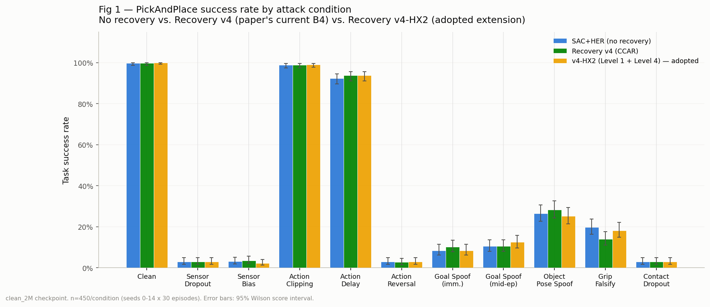
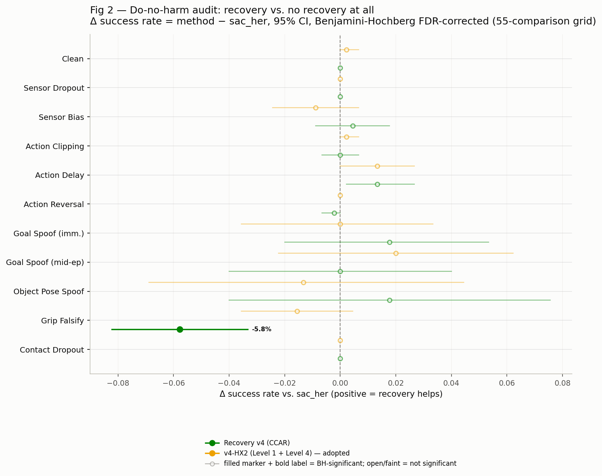
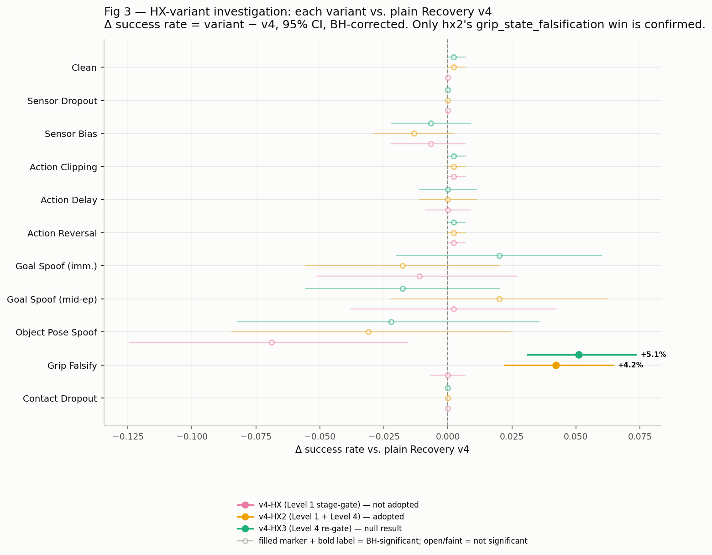

# TAIRO Recovery v4-HX Results Package

*Generated 2026-07-22. Packaging/presentation only — no new experiments. Every
number below is read from CSVs already produced and validated at full power
(n=450/condition, seeds 0-14, clean_2M PickAndPlace checkpoint) earlier this
week. Built for the poster/video results deliverable per mentor feedback
2026-07-22: "present the stage-aware and attack-aware recovery methods, the
routing fix, and any additional recovery improvements... using tables, charts,
statistical comparisons, and brief interpretations."*

Scope: `sac_her_recovery_v4_hx`, `sac_her_recovery_v4_hx2`, `sac_her_recovery_v4_hx3`,
and the do-no-harm audit, all relative to the existing `sac_her` (no recovery)
and `sac_her_recovery_v4` (paper's current B4/Tier-1-CCAR method) baselines.

---

## 1. Headline: recovery success rate by attack condition

No recovery vs. plain Recovery v4 vs. the adopted v4-HX2 extension track closely
across almost every condition — the hierarchy-conditioned extension does not
trade away performance anywhere to get its win. Full method x condition table:
`recovery_hx_success_by_method_condition.md`.

## 2. Do-no-harm audit: recovery vs. no recovery at all

Across the full 55-comparison grid (5 methods x 11 conditions, BH-FDR
corrected), exactly **one** method/condition pair reaches significance in
either direction: **plain `sac_her_recovery_v4` — the paper's existing
headline B4 method — does statistically significant harm on
`grip_state_falsification`** relative to doing nothing at all (19.8% → 14.0%,
BH-adjusted p=0.00017). Every other point in the grid, including all of
`v4_hx2`'s comparisons against `sac_her`, is statistically indistinguishable
from zero effect at this sample size — recovery is neither confirmed to help
nor confirmed to hurt anywhere else.

## 3. HX-variant investigation: what worked, what didn't

Three variants were tested against plain `v4`, all at full power:

- **`v4-HX2` (Level 1 stage-gate + Level 4 attack-family down-weight) is the
  only variant with a confirmed win**: +4.2pp on `grip_state_falsification`
  (14.0% → 18.2%, BH-adjusted p=0.0034) — exactly the condition where plain v4
  was just shown to do harm. This is what's adopted for the paper.
- **`v4-HX` (Level 1 stage-gate alone) has no confirmed benefit anywhere.**
  Its `object_pose_spoof` regression (-6.9pp) is a real point estimate but
  does not survive BH correction across the full 11-condition grid
  (p=0.180) — downgraded from an earlier "confirmed harm" call to
  plausible-but-unconfirmed. Not adopted.
- **`v4-HX3` (re-gating `relocalization_expert` on Level 4's `perception_state`
  signal) is a genuine, well-powered null** on its target condition
  (`object_pose_spoof`: -2.2pp vs. v4, +0.9pp vs. v4-HX2, neither significant).
  It does no new harm anywhere and leaves `v4-HX2`'s `grip_state_falsification`
  win intact (+5.1pp vs. plain v4, still significant). Not adopted, but
  confirms the win it was meant to preserve survives.

## 4. Key statistical findings (curated)

| finding | condition | Δ | 95% CI | p (BH) | significant |
|---|---|---|---|---|---|
| Plain v4 does significant HARM vs. no recovery | grip_state_falsification | −5.8% | [−8.2%, −3.3%] | 0.0002 | **YES** |
| v4-HX2 fixes the harm: significant win vs. plain v4 | grip_state_falsification | +4.2% | [+2.2%, +6.4%] | 0.0034 | **YES** |
| v4-HX2 vs. no recovery: parity restored | grip_state_falsification | −1.6% | [−3.6%, +0.4%] | 0.825 | no |
| v4-HX alone: object_pose_spoof regression | object_pose_spoof | −6.9% | [−12.4%, −1.6%] | 0.180 | no |
| v4-HX3 targeted fix vs. plain v4 | object_pose_spoof | −2.2% | [−8.2%, +3.6%] | 1.000 | no |
| v4-HX3 vs. adopted v4-HX2 | object_pose_spoof | +0.9% | [−4.9%, +6.4%] | 1.000 | no |
| v4-HX3 preserves the hx2 win vs. plain v4 | grip_state_falsification | +5.1% | [+3.1%, +7.3%] | 3.4e-05 | **YES** |

Full curated table: `recovery_hx_key_findings_table.md` / `.csv`. Full
underlying comparisons: `recovery_do_no_harm_audit.csv` (55 rows),
`recovery_v4_hx_vs_v4_full_grid.csv` (22 rows), `recovery_v4_hx3_evaluation.csv`
(44 rows).

## 5. Bottom line

- **Adopted: `sac_her_recovery_v4_hx2`.** It is the sole variant with a
  BH-corrected-significant benefit, and that benefit is not just "better than
  v4" in the abstract — it corrects a real, previously undocumented harm in
  the paper's own current headline B4 method on `grip_state_falsification`.
- **Not adopted: `sac_her_recovery_v4_hx`.** No confirmed benefit anywhere;
  inherits plain v4's `grip_state_falsification` harm unchanged.
- **Not adopted: `sac_her_recovery_v4_hx3`.** A well-powered, genuine null on
  its target condition. Investigated and closed, not left as an open question —
  does no harm and doesn't need to be revisited without new evidence.
- **Open, not decided here:** whether the paper's existing Tier 1 CCAR
  write-up needs a caveat on plain v4's `grip_state_falsification` harm,
  independent of the v4-HX2 adoption decision (`RECOVERY_V4.md` §5.7).

## Method notes

- All success-rate CIs (Fig 1, `recovery_hx_success_by_method_condition.csv`)
  are 95% Wilson score intervals on n=450 per method/condition cell.
- All delta CIs and p-values (Figs 2–3, both tables) are paired bootstrap CIs
  / exact paired McNemar tests on the same 450 physically-identical episodes
  per arm (same `(condition, seed, episode_in_seed)`), Benjamini-Hochberg
  FDR-corrected within each systematic scan — see
  `scripts/audit_recovery_do_no_harm.py` for the full method.
- Figure/table generation: `scripts/build_recovery_hx_results_package.py`
  (reuses `scripts/evaluate_recovery_v4_hx3.load_all_episodes()` for data
  loading — no reimplemented loading/stats logic).
